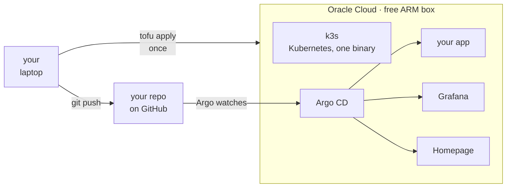
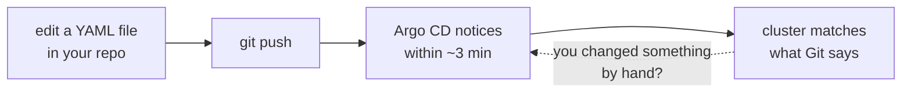

# oci-k3s-starter

[](https://github.com/adirbd/oci-k3s-starter/actions/workflows/validate.yaml)
[](LICENSE)


**A free ARM server running your container, with deploys and monitoring already wired.**

Oracle Cloud's Always Free tier includes an Arm server. This repo is sized for **2 cores and
12 GB of RAM** — what a free account reliably keeps — and yours may allow more.
This turns it into a small personal platform: `k3s` for the runtime, **Argo CD** so a
`git push` is the deploy button, **Grafana** so you can see what your app is doing, and
**Homepage** so you have one URL that lists everything.

One `tofu apply`. No Kubernetes knowledge required to get to the first running app.

```bash
git clone https://github.com/adirbd/oci-k3s-starter.git   # or your fork
cd oci-k3s-starter

oci session authenticate          # browser login, no keys on disk
cd terraform
cp terraform.tfvars.example terraform.tfvars   # fill in 3 values
tofu init
../scripts/preflight.sh           # 10 seconds; catches what otherwise fails 20 minutes in
tofu apply

cd .. && ./scripts/connect.sh     # opens every dashboard  (connect.ps1 on Windows)
```

> **Expect `Out of host capacity` on the first apply.** Free ARM capacity is scarce; it is
> not your configuration, and it is the single most common thing that goes wrong. There is
> a script that retries it properly — rotating availability *and* fault domains, backing
> off when throttled — until Oracle says yes: `./scripts/retry-apply.sh`.

**Works on macOS, Linux and Windows.** Every command that differs between them is given in
both forms; Windows needs PowerShell, not WSL, though WSL is fine if you have it.

---

## What you get



<!-- No hardcoded colors on purpose: GitHub renders mermaid in the viewer's theme, and a
     fixed light fill makes the subgraph title unreadable in dark mode. -->

| | |
|---|---|
| **k3s** | single-node Kubernetes, the light kind — the whole control plane is one binary |
| **Argo CD** | points at a Git repo and keeps the cluster matching it |
| **Grafana + VictoriaMetrics** | metrics for the node, the cluster and your app |
| **Homepage** | one dashboard linking the above |
| **Serial console** | a way back in when you break networking, which you will |

Everything is declared here. If the box is lost, `tofu apply` builds it again.

**You do not need to know Kubernetes to use this.** You need to know how to write a
Dockerfile and push to Git. The deploy loop is:



That last arrow is the useful part: Argo puts things back. There is no deploy command to
run and no server to log into.

## Why this, and not a homelab template

The great cluster templates ([onedr0p](https://github.com/onedr0p/cluster-template),
[khuedoan](https://github.com/khuedoan/homelab)) assume hardware you own and a stack you
want to master. This sits at the other end of the ladder:

- **Hardware: none.** The server is Oracle's and the bill is zero — enforced by variable
  caps and an optional zero-spend budget alert, not by good intentions.
- **Knowledge: a Dockerfile and `git push`.** Kubernetes is the engine here, not the
  syllabus.
- **Scope: four rungs, each complete on its own.** It ends roughly where the big templates
  begin — and by then you will know whether you want to climb into one.

---

## Climb only as far as you need

The repo is built as four rungs. **Each one works on its own** — stop whenever you have
what you came for.

### Rung 1 — a box running your container
*Needs: an Oracle Cloud account. That's it.*

`tofu apply` gives you the server, k3s, Argo CD, Grafana and Homepage, with a sample app
already deployed from a public repo. **No domain, no DNS, no credentials to create.**
You reach it with `kubectl port-forward`.

This rung is deliberately credential-free, so nothing can go wrong before you have seen it
work.

→ [docs/rung-1-the-box.md](docs/rung-1-the-box.md)

### Rung 2 — real URLs instead of port-forward
*Needs: a domain — about $10/year. The only thing in this repo that costs money.*

Adds a Cloudflare Tunnel, so `grafana.yourdomain.com` works from anywhere — **without
opening a single inbound port** — and Cloudflare Access puts a login in front of it.

Skip this rung entirely if you do not own a domain. Everything above keeps working.

→ [docs/rung-2-real-urls.md](docs/rung-2-real-urls.md)
   · no domain? → [serving it without Cloudflare](docs/without-cloudflare.md)

### Rung 3 — deploy *your* app
*Needs: your source, and a Dockerfile.*

Kubernetes runs images, not source — so a build step has to exist somewhere. There is a
ready-to-copy GitHub Actions workflow that builds yours and pushes it to ghcr.io free, and
then Argo deploys it on every push.

⚠ **Build for `linux/arm64`.** The free tier is Ampere, and an amd64 image fails with
`exec format error` — a message that says nothing about architecture and eats an evening.

→ [docs/rung-3-your-app.md](docs/rung-3-your-app.md)

### Rung 4 — secrets without secrets on disk
*Needs: nothing extra — it is already in your Oracle account.*

**OCI Vault** plus External Secrets. The box authenticates *by being that instance* — an
instance principal — so there is no API key on the server to steal or rotate.

→ [docs/rung-4-secrets.md](docs/rung-4-secrets.md)

---

## What you actually need

**Required**

- An **Oracle Cloud account** — the Always Free tier, no card charged
- **git**, to get these files
- **[OpenTofu](https://opentofu.org)** (or Terraform)
- The **[OCI CLI](https://docs.oracle.com/en-us/iaas/Content/API/SDKDocs/cliinstall.htm)**, for the browser login
- **kubectl**, to talk to the cluster once it exists

**Recommended, not required**

- **Cloudflare** + a domain — **the one thing here that costs money** (~$10/year for the
  domain; the Cloudflare plan itself is free). Strongly recommended anyway: it is what
  gives you a valid HTTPS certificate, a login in front of everything, and no web ports
  open (SSH stays; nothing else does).
  Everything still works without it — rung 1 needs none of it. See
  [rung 2](docs/rung-2-real-urls.md) for why it is worth ten dollars.
- **Tailscale** — a private path to the box that survives you breaking the public one.
- **healthchecks.io** / **ntfy** — free, for "tell me when it dies" and "tell my phone".

## Login: a browser, not a key file

Most Oracle guides have you generate an RSA key, upload the public half, copy a
fingerprint, and leave a `.pem` in `~/.oci` forever. This repo defaults to the other way:

```bash
oci session authenticate      # opens a browser
oci session refresh           # when it expires
```

```hcl
provider "oci" {
  auth                = "SecurityToken"
  config_file_profile = "my-profile"
}
```

A session expires. A key file on your laptop does not — it sits there until it leaks. The
browser flow is both the safer option **and** the shorter one, which is rare enough to be
worth choosing deliberately.

API-key auth is still supported, and documented for CI, where no browser exists.

## Cost, and the limit that bites

Always Free is genuinely free. The one thing to understand is the **ARM allowance**, because
overshooting it is punished far harder than you would expect:

> **Exceeding it disables and then deletes EVERY Ampere instance in your tenancy after 30
> days — not just the excess.** Nothing fails at the moment you overshoot, so the cause is a
> month gone by the time the effect arrives.

New accounts get a larger allowance during their **trial** (roughly 30 days from signup) and
a smaller one afterwards. The defaults here — 2 cores, 12 GB — are sized for the *smaller*
figure on purpose, so the box survives that transition without you doing anything, and
`variables.tf` refuses values above it rather than trusting you to remember.

Allowances vary by account and change over time, so check yours rather than trusting any
guide, including this one: **Governance → Limits, Quotas and Usage**, filtered to
`VM.Standard.A1.Flex`.

**Upgraded to Pay As You Go to escape capacity limits?** That swaps "cannot be billed" for
"bills for the same mistake" — set `budget_alert_email` in `terraform.tfvars` and a
zero-spend budget mails you the moment anything bills at all.

[docs/cost-and-limits.md](docs/cost-and-limits.md) has the rest — what the stack itself
consumes, and how much is left for your app. The short answer is that the platform costs
about a quarter of the machine.

## Keeping it current

Version pins go stale, and a starter repo that installs last year's everything is worse
than no starter repo. [Renovate](https://github.com/apps/renovate) is configured here to
open pull requests for the chart, image, provider and Argo CD pins.

> ⚠ **The config does nothing until the App is installed on the repo.** A `renovate.json5`
> with no Renovate behind it opens zero PRs, silently and forever — and looks exactly like
> a Renovate with nothing to do. Treat *"when did the bot last open a PR?"* as a health
> signal.

## State and tokens

Two questions that arrive on day two — where Terraform state should live once local stops
being enough, and where to keep your Cloudflare token — are answered in
**[docs/state-and-credentials.md](docs/state-and-credentials.md)**.

The short versions: put state in **OCI Object Storage**, because Always Free includes 20 GB
and it speaks S3, so it needs no new vendor — and encrypt it, because state contains the
Grafana password and the console private key in cleartext. For the token, export
**`CLOUDFLARE_API_TOKEN`** (the provider reads it natively) from your password manager at
the start of a session, rather than writing it to a file.

## Updating

`git pull` then `tofu apply` picks up most changes — anything in `kubernetes/` is Argo's
job, and anything Terraform manages it will reconcile.

**One category does not work that way.** A few things are delivered by **cloud-init**, which
runs *once, at first boot*: the root Application, the Grafana admin Secret, the vault store.
If a new version adds one, your apply succeeds and your running box simply never receives
it — the symptom is usually a pod stuck in `CreateContainerConfigError` referring to
something that does not exist.

Two ways forward, in this order:

1. **Create the missing thing by hand.** It is normally one `kubectl` command, and
   [troubleshooting](docs/troubleshooting.md#a-pod-says-createcontainerconfigerror-after-pulling-a-new-version)
   has the shape of it.
2. **Rebuild deliberately** — `tofu apply -replace=oci_core_instance.main` re-runs cloud-init
   and picks up everything.

> ⚠ **Rebuilding is not free on a free tier.** `-replace` destroys the instance *before*
> creating its replacement, and Ampere capacity is not reserved — you may wait hours for
> another. Fix in place unless you were willing to lose the box.

The box is disposable by design, but "disposable" assumes you can get another one, and on
Always Free that is a hope rather than a guarantee.

## Removing it

```bash
cd terraform
tofu destroy
```

That takes the instance, its boot volume, the network, the serial console and — if you
enabled them — the Cloudflare tunnel, DNS records and Access applications. Nothing is left
running and nothing is billed.

**One exception, and it surprises people:** if you enabled rung 4, **OCI does not delete a
vault immediately.** Deletion is *scheduled*, with a minimum waiting period measured in
days, so the vault stays visible in the console marked `PENDING_DELETION` after `destroy`
reports success. That is Oracle's behaviour, not a failure, and a vault in that state costs
nothing. See [rung 4](docs/rung-4-secrets.md#removing-it).

## Where this came from

Extracted from a working two-site homelab where this box is the off-site half — it watches
the house from outside, because a machine cannot observe its own outage. The watching parts
are not in here; what is left is the useful skeleton underneath them.

Issues and PRs are welcome, and they work: several of the best fixes in here — the
tunnel-only kubeconfig, the OCI CLI session gotchas, an Argo sync wedge — arrived as
issues from the repo's first users. If something ate your evening, [say
so](https://github.com/adirbd/oci-k3s-starter/issues); the fix usually lands the same week.

## Licence

MIT — see [LICENSE](LICENSE).
