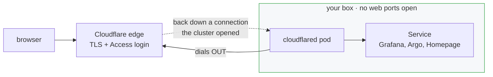

# Rung 2 — real URLs instead of port-forward

**You need:** a domain, with its nameservers pointed at Cloudflare.

**This is the only part of this repo that costs money** — roughly **$10 a year** for the
domain. Cloudflare's plan, the tunnel, the certificate, Access, the DDoS protection and the
CDN are all free; you are paying a registrar for a name, not paying Cloudflare.

> **Bought it through Cloudflare?** Then the nameservers are already pointed and there is
> nothing to do — skip to step 1.
>
> Cloudflare Registrar sells at wholesale with no markup (about $10-11/yr for a `.com` at
> the time of writing; registrar prices drift), and
> other TLDs go cheaper — a `.xyz` or `.dev` is often a few dollars. Any registrar works;
> you just point the nameservers at Cloudflare afterwards.

**You can skip this rung entirely.** Everything from rung 1 keeps working with
`kubectl port-forward` — and if you want your app public *without* buying a domain, there
is a third way: [serving it without Cloudflare](without-cloudflare.md), which opens 80/443
and runs Traefik. You give up the free certificate and the login; the doc is blunt about
what that costs.

---

## Why it is worth ten dollars

Nine reasons, and the first one is the one people underestimate.

### 1. A valid HTTPS certificate, forever, with no work

Not "encrypted" — **valid**, as in no browser warning and a real padlock. This matters more
than it sounds, because **modern browsers refuse to run large parts of the web platform on
an insecure origin**: service workers, WebAuthn/passkeys, the clipboard API, camera and
microphone, geolocation, PWA installation, and HTTP/2 all require HTTPS.

Without it you are not merely seeing a warning — you are developing against a browser with
features switched off, and debugging why your app behaves differently on your laptop than
in production.

The alternative is running cert-manager, solving a DNS-01 challenge, and owning a renewal
that fails silently at 3am. Here the certificate is Cloudflare's problem and always has
been.

### 2. Nothing is listening on the internet

The connector dials **out**. Your security list keeps exactly one inbound rule, for SSH.
There is no web port to scan, no ingress controller to have a CVE, and no "I'll just open
443 for a minute".

### 3. Your server's IP is never published

Traffic reaches Cloudflare, not you. An attacker who wants to hit your box directly has to
find it first, and DNS will not tell them. Origin-IP exposure is how most "I was behind
Cloudflare and still got attacked" stories start.

### 4. A login in front of everything, that you did not write

Cloudflare Access checks identity **before** the request reaches your cluster. Grafana ships
a generated password — but it is still a login on the public internet; Argo CD holds
credentials to your infrastructure. Neither should be answering
strangers, and writing your own auth layer for internal tools is a bad use of a weekend.

Adding a collaborator is adding their email address. There are no user accounts on your box
to create, rotate or forget to remove.

### 5. It works from networks you do not control

Corporate wifi, hotel wifi, mobile carriers behind CGNAT, and any network blocking
non-standard ports — all fine, because it is ordinary HTTPS to an ordinary hostname. A
`kubectl port-forward` needs the API server reachable; this does not.

### 6. Your box's IP can change and nothing breaks

The instance has an *ephemeral* public address. The DNS records point at the tunnel, not at
an IP, so a rebuild costs you nothing. Without this you are maintaining dynamic DNS.

### 7. DDoS, WAF and bot protection, at no cost

Absorbed at the edge before it reaches a box that has two cores. Also: your Grafana will not
be crawled and indexed, which is a surprisingly common way people discover their dashboards
were public.

### 8. URLs you can actually share

`grafana.example.com` opens on your phone, on someone else's laptop, in a message to a
friend. `localhost:3001` opens nowhere, and a shared demo is most of the point of running
something publicly at all.

### 9. It is less machinery, not more

Opening 443 the traditional way means an ingress controller, a certificate issuer, an ACME
solver, a renewal cron, and a listening port — five things that can break. The tunnel is one
deployment that dials out.

> **No domain, want to try it anyway?** `cloudflared tunnel --url http://localhost:3000`
> gives you a random `*.trycloudflare.com` address with no account and no domain. It is
> ephemeral and has no Access in front of it, so treat it as a demo rather than a setup —
> but it costs nothing and shows you the shape of the thing.

---

## What it gets you

`grafana.example.com` works from anywhere, with a login in front of it, **and your box
opens no web ports at all** — the only inbound rule stays SSH.

That last part is the interesting bit. A Cloudflare Tunnel is a connector *inside* the
cluster that dials **outbound** to Cloudflare and holds the connection open. Traffic
arrives at Cloudflare's edge and is handed back down that existing connection.



The connector dials **out** and holds the connection open. Requests arrive at Cloudflare
and come back down it — so nothing is listening on the public internet.

Your security list still has exactly one inbound rule, for SSH. There is no web port to
scan, and nothing serving HTTP that could have a CVE.

Note there is **no ingress controller** in that path. The tunnel terminates the request and
hands it straight to a Kubernetes Service, so k3s's Traefik stays disabled and you save
both the memory and the certificate machinery.

## 1. Get three values from Cloudflare

| | where |
|---|---|
| **Account ID** | dashboard → right-hand sidebar |
| **Zone ID** | same sidebar, with your domain selected |
| **API token** | My Profile → API Tokens → Create |

The token needs:

- **Zone → DNS → Edit**
- **Account → Cloudflare Tunnel → Edit**
- **Account → Access: Apps and Policies → Edit** (only if you want the login)

## 2. Enable Access on your account — once, in a browser

**Only if you are setting `access_allowed_emails`** (you should be), and **only the first
time.**

Zero Trust Access is an account feature that starts switched off. Terraform cannot turn it
on, so the first apply that creates an Access policy fails like this:

```
403 code 9999: access.api.error.not_enabled: Access is not enabled.
```

It reads like a token permissions problem. It is not — the token is fine, the feature is
off. Worse, everything else applies successfully first, so you are left with a half-built
stack and a confusing error.

Turn it on at **<https://one.dash.cloudflare.com>** — it asks you to choose a team domain
(something like `yourname.cloudflareaccess.com`). That is the whole step.

New accounts also get **Cloudflare's own identity provider** switched on at the same time,
so logging in later means signing in with the Cloudflare account you already have — no
Google Cloud project, no third-party setup. See
[how you actually log in](#how-you-actually-log-in) if you want something else.

## 3. Turn it on

```hcl
# terraform.tfvars
enable_cloudflare = true
domain            = "example.com"
cf_account_id     = "..."
cf_zone_id        = "..."

# ⚠ Without this, your hostnames are PUBLIC.
access_allowed_emails = ["you@example.com"]
```

```bash
export TF_VAR_cf_api_token=...    # keep it out of the file
tofu apply
```
```powershell
$env:TF_VAR_cf_api_token = "..."
tofu apply
```

> The variable lives in your **shell**, for the length of that session. This repo has no
> `.env` convention and nothing here reads one — if you put the token in a file, no script
> will load it and the apply will fail on authentication.
>
> `CLOUDFLARE_API_TOKEN` works too, and is the provider's own convention — see
> [state and credentials](state-and-credentials.md#your-cloudflare-token) for fetching it
> from a password manager instead of typing it.

That creates the tunnel, its routing, a proxied CNAME per hostname, and — if you listed
emails — a Cloudflare Access application in front of each one.

> **Public app, no login.** Every route above is Access-gated by default. To serve a
> hostname **publicly** — no Access login, e.g. a ticketing site — set `access = false` on
> that route in `tunnel_routes`:
> ```hcl
> tunnel_routes = {
>   # ...
>   myapp = { service = "http://myapp.myapp.svc.cluster.local:3000", access = false }
> }
> ```
> The tunnel still fronts it (no inbound ports, no certificate to own); Access is simply
> skipped for that hostname. See also the worked example in `terraform/terraform.tfvars.example`.

## 4. Give the connector its token

```bash
tofu output -raw cloudflared_secret_command           # macOS, Linux, WSL
```
```powershell
tofu output -raw cloudflared_secret_command_windows   # Windows PowerShell
```

Then run what it prints. It creates the namespace and the Secret in one go.

> **Why two outputs.** The Unix form pipes the token through `/dev/stdin`, which does not
> exist on Windows — running it verbatim there fails with "no such file or directory". The
> PowerShell form passes the token through a variable instead, which is briefly visible to
> anything listing processes. That is an acceptable trade on your own laptop, and a good
> reason to prefer the next paragraph.

> **Or skip this step entirely.** [Rung 4](rung-4-secrets.md#what-rungs-2-and-4-do-together)
> puts the token in OCI Vault and has the cluster fetch it — no secret on your laptop, no
> platform-specific command, and it survives a rebuild. This hand-made Secret does not.

> This Secret is created **by hand**, which means a rebuilt cluster no longer has it and the
> connector CrashLoops until you re-run the command. [Rung 4](rung-4-secrets.md#what-rungs-2-and-4-do-together)
> removes that step entirely — the token goes to OCI Vault and the cluster fetches it
> itself. Worth doing if this box is meant to be disposable.

## 5. Deploy the connector

It ships in `kubernetes/optional/`, which Argo does **not** watch — otherwise every rung-1
user would get a CrashLooping pod for a tunnel they never set up.

```bash
kubectl apply -f kubernetes/optional/app-cloudflared.yaml
```

That works immediately and needs no fork — Argo CD manages the app from the moment the
object exists, whoever created it.

**The durable way** is to have Argo read it from Git, which needs the repo Argo watches to
be *yours* — that is [rung 3](rung-3-your-app.md). Once it is:

```bash
cp kubernetes/optional/app-cloudflared.yaml kubernetes/applications/
git commit -am "enable the tunnel" && git push
```

> ⚠ Do not run the second form before rung 3. Out of the box `gitops_repo_url` points at
> **this** project, so a push goes somewhere Argo is not watching — or fails outright — and
> the symptom is simply nothing happening.

Argo picks it up within a few minutes. Then:

```bash
kubectl -n cloudflared get pods          # two, both Running
tofu output urls
```

---

## Two things that will bite you

### Homepage rejects its own hostname

Homepage validates the `Host` header against an allowlist. The default in
`app-homepage.yaml` only knows about `localhost`, so through the tunnel every request
fails with a bare **"Host validation"** error and the page never renders — with nothing to
say a config key is missing.

Add your hostname:

```yaml
env:
  - name: HOMEPAGE_ALLOWED_HOSTS
    value: localhost:3000,home.example.com
```

### Argo CD and the redirect loop

`argocd-server` serves HTTPS with a **self-signed** certificate and 301-redirects plain
HTTP to HTTPS. So:

- route it over HTTP → infinite redirect loop
- route it over HTTPS → certificate verification fails

`tunnel_routes` therefore sends Argo over HTTPS with `no_tls_verify = true`. The
alternative is patching `argocd-cmd-params-cm` to set `server.insecure=true`; this repo
prefers leaving Argo exactly as upstream ships it, since the unverified hop is pod-to-pod
inside a single node.

## What Access actually does

It puts an identity check **ahead of** your cluster: `grafana.example.com` asks who you are
before the request reaches the tunnel at all. Your app never sees an unauthenticated
request.

Three settings here came from a real outage rather than a preference:

- **`session_duration = "168h"`** — when a session expires mid-use, Access redirects the
  in-flight XHR to its login page. A browser cannot report that as "your session expired";
  it reports a **CORS error**. Every app appears broken at once, and nothing says why.
- **`options_preflight_bypass`** — OPTIONS preflights carry no cookies, so Access treats
  them as unauthenticated and swallows them into the login redirect. Guaranteed CORS
  failure on any non-simple request.
- **`http_only_cookie_attribute`** — the session cookie should not be readable by page JS.

### How you actually log in

Access checks *who you are* before the request reaches your cluster — but something has to
vouch for that. You have three options, and **the default needs nothing outside Cloudflare**.

**Cloudflare (the default, and what to use)**
Since mid-2026, new Zero Trust accounts get **Cloudflare itself** as the identity provider.
You sign in with the Cloudflare account you already have, backed by its own MFA. Nothing to
configure, nowhere else to go, and there is a *Restrict to account members* option that
limits logins to people on your account. If you are reading this on a fresh account, this is
already switched on.

**One-time PIN**
Access emails a code to any address on your allowlist. Also no setup, but weaker in a
specific way: **anyone who can read that mailbox can log in.** Fine for yourself; think
before adding a whole domain.

**Google, GitHub, Okta, and the rest — genuinely more work, and outside this repo**
These are *federated* logins, which means creating an application on the other side and
handing Cloudflare its client ID and secret.

⚠ **Google specifically requires a Google Cloud project.** You create an OAuth 2.0 client in
the Google Cloud console, configure a consent screen, and add Cloudflare's callback URL. It
works well and it is a different product with its own concepts — which is why this guide
does not walk through it. **GitHub is markedly less work** if you want federated login: an
OAuth App is a handful of fields in your GitHub settings, no project and no consent screen,
and you already have an account since you forked this repo.

Cloudflare's own docs are the right place for either:
<https://developers.cloudflare.com/cloudflare-one/integrations/identity-providers/>

> **The practical advice:** start with the Cloudflare provider, because it costs you nothing
> and is stronger than emailed codes. Move to Google or GitHub when you want other people
> logging in with an identity they already manage — not before.

## Log into Grafana with the same identity

Right now there are two logins: Access at the edge, then Grafana's own underneath. You can
collapse them, so whoever Access let in is simply *already logged into Grafana*.

**And this is the answer to "should we use Google or the Cloudflare login?" — it does not
matter here.** Access does the authenticating and hands Grafana a signed statement of who
you are. Change your identity provider later and Grafana needs no edit: it trusts whatever
Access verified.

Access sends every authenticated request a `Cf-Access-Jwt-Assertion` header containing a
signed JWT with the user's verified `email`. Grafana can validate that against Cloudflare's
public keys and log the person in.

**You need two values:**

```bash
tofu output access_aud_tags        # the AUD for the grafana app
```

…and your **team domain**, the one you chose when enabling Access — `something.cloudflareaccess.com`.

Then add this to `grafana:` in `kubernetes/applications/infra-observability.yaml`:

```yaml
grafana.ini:
  auth.jwt:
    enabled: true
    header_name: Cf-Access-Jwt-Assertion
    email_claim: email
    username_claim: email
    auto_sign_up: true
    jwk_set_url: https://YOUR-TEAM.cloudflareaccess.com/cdn-cgi/access/certs
    expect_claims: '{"aud": "YOUR-AUD-TAG"}'
  auth:
    signout_redirect_url: https://YOUR-TEAM.cloudflareaccess.com/cdn-cgi/access/logout
```

Commit, and Argo rolls Grafana. Visiting `grafana.example.com` now lands you straight in.

> ⚠ **`expect_claims` is the load-bearing line.** Without it Grafana accepts any JWT your
> team domain signed — including one issued for a *different* application. Pinning the AUD
> is what makes this a check rather than a formality.

> **Keep the password login working while you test.** If the JWT config is wrong you get a
> redirect loop or a blank page, and `admin` + `tofu output -raw grafana_admin_password` is
> how you get back in to fix it. Add `disable_login_form: true` only once SSO works.

Everyone you add to `access_allowed_emails` gets a Grafana account automatically, named by
their email. Roles are Grafana's business after that.

## Rolling back

Set `enable_cloudflare = false` and apply — the tunnel, DNS records and Access apps are all
removed. Delete `kubernetes/applications/app-cloudflared.yaml` and Argo prunes the
connector. You are back at rung 1 with nothing left behind.

## Next

- Deploy your own app → [rung 3](rung-3-your-app.md)
