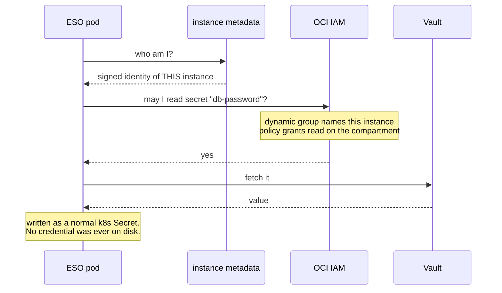

# Rung 4 — secrets without secrets on disk

**You need:** nothing extra. OCI Vault is already in your account, and a `DEFAULT` vault
with software keys is free.

---

## The problem with every other option

Your app needs a database password. The usual answers:

- **A Secret in the cluster** — fine, until you want it in Git. And base64 is not encryption.
- **Encrypted in Git** (SOPS, sealed-secrets) — better, but now there is a *decryption key*,
  and it has to live on the box. You moved the problem.
- **A cloud secret manager** — better still, but the box needs an API credential to talk to
  it. You moved the problem again.

Every one of them ends with **a credential on the machine** that unlocks the rest. On a box
with a public IP, that is the thing you least want to have.

## What OCI gives you instead

**Instance principal.** The box authenticates *by being that instance* — Oracle already
knows which VM is asking. No key, no token, no file. Nothing to rotate, and nothing to
steal from the disk.



Take the disk and you get nothing: the credential was never on it.

## Turn it on

```hcl
# terraform.tfvars
enable_vault = true
tenancy_ocid = "ocid1.tenancy.oc1..aaaa..."
```

```bash
tofu apply
```

> ⚠ **`tenancy_ocid` is required, and it is not the same as `compartment_ocid`.** Dynamic
> groups and policies are tenancy-level objects — they cannot be created anywhere else. It
> also means this step needs an account allowed to write IAM at the tenancy. As the account
> owner you are; a restricted user may not be, and the failure is a 404 on the policy rather
> than a clear "you are not allowed to".

That creates four things: a vault, a key, a **dynamic group naming exactly this instance**,
and a policy letting that group read secrets in your compartment.

## Deploy the operator, then the store

Order matters — the CRDs must exist before the store, and the store before any
`ExternalSecret` that uses it.

```bash
kubectl apply -f kubernetes/optional/app-external-secrets.yaml
```

That works immediately and needs no fork — Argo CD manages the app from the moment the
object exists, whoever created it.

**The durable way** is to have Argo read it from Git, which needs the repo Argo watches to
be *yours* — that is [rung 3](rung-3-your-app.md). Once it is:

```bash
cp kubernetes/optional/app-external-secrets.yaml kubernetes/applications/
git commit -am "add external secrets" && git push
```

> **The ClusterSecretStore applies itself.** When `enable_vault = true`, Terraform renders it
> into cloud-init and the box applies it on every bootstrap run — so there is nothing to
> paste, and a rebuilt cluster gets it back without anyone typing. The
> `clustersecretstore_manifest` output still exists if you want to inspect or apply it by
> hand.
>
> It is applied on a timer, so if External Secrets is not installed yet the first attempt
> fails harmlessly and the next run (within 15 minutes) succeeds.

> ⚠ Do not run the second form before rung 3. Out of the box `gitops_repo_url` points at
> **this** project, so a push goes somewhere Argo is not watching — or fails outright — and
> the symptom is simply nothing happening.


The manifest is generated with your vault OCID and region already in it, so there is
nothing to paste.

### Upgrading an existing box

If the box was built **before** you enabled rung 4, cloud-init already ran and did not
deliver the ClusterSecretStore. The `tofu apply` created the vault and IAM objects, but the
store has to be applied by hand once:

```bash
tofu output -raw clustersecretstore_manifest | kubectl apply -f -
```

Check it landed:

```bash
kubectl get clustersecretstore oci-vault
```

This is a one-time step: nothing removes the store once applied, and a **rebuilt** box
gets it from cloud-init automatically. (The bootstrap timer does *not* re-assert it on an
upgraded box — the file it applies was written, empty, at first boot and never changes.)

## Using it

Put a secret in the vault (console → Identity & Security → Vault → Secrets, or the CLI),
then reference it **by name**:

```yaml
apiVersion: external-secrets.io/v1
kind: ExternalSecret
metadata:
  name: db-password
  namespace: my-app
spec:
  refreshInterval: 1h
  secretStoreRef:
    name: oci-vault
    kind: ClusterSecretStore
  target:
    name: db-password          # the Kubernetes Secret this creates
  data:
    - secretKey: password      # the key inside that Secret
      remoteRef:
        key: my-app-db-password   # the NAME of the vault entry
```

**Note what is in Git: a name, never a value.** That file is safe in a public repo. The
value is fetched at runtime by a machine that proved its own identity.

Your Deployment then uses it like any other Secret:

```yaml
env:
  - name: DB_PASSWORD
    valueFrom:
      secretKeyRef:
        name: db-password
        key: password
```

## What rungs 2 and 4 do together

With both enabled, Terraform writes the **tunnel token straight into the vault**, and one
more file replaces rung 2's manual `kubectl create secret` step for good:

```bash
cp kubernetes/optional/externalsecret-cloudflared.yaml kubernetes/applications/
git commit -am "cloudflared reads its token from the vault" && git push
```

That deploys an `ExternalSecret` which maps the vault entry to the `cloudflared-token`
Secret the connector reads. From then on the credential exists, but **never on a laptop,
never in a shell, and never in this repository** — and because the ExternalSecret lives in
Git, a rebuilt cluster recreates it without anyone typing anything.

> ⚠ **It must be in Git, not applied by hand.** A hand-applied ExternalSecret disappears
> with the cluster, which puts you back to re-running the manual command after every
> rebuild — the exact problem this removes.
>
> ⚠ **Check the key name if you renamed the box.** Terraform stores the token as
> `<instance_name>-cloudflared-token`; the file ships with the default `k3s-01-...`.
> `tofu output vault_secret_names` prints the real name.

Order matters: External Secrets and the ClusterSecretStore have to exist first, so do the
steps above this section before this one.

## What rung 4 does to the credentials you already have

Enabling rung 4 stops two secrets from ever touching instance metadata, because Terraform
switches how they are delivered (see [rung 1](rung-1-the-box.md) and
[rung 3](rung-3-your-app.md)):

- **Grafana's admin password** — written to the vault and delivered as an `ExternalSecret`
  that reads it at runtime, instead of a plaintext Secret baked into cloud-init. With
  rung 4 off it is still delivered as a plaintext Secret (the only way to get a password
  to a box with no vault), and it still lands in Terraform state either way.
- **Argo's private-repo credential** — stored as a JSON object in the vault and read as an
  `ExternalSecret`, instead of a hand-made plaintext Secret. The box can read it before it
  can read your private repo (that is the point of instance principal), so there is no
  chicken-and-egg.

Both files are rendered into cloud-init only when `enable_vault = true`; the box applies
them on its own every bootstrap run, so a rebuilt cluster gets them back without a human.
The value never sits in metadata — which is the difference the first rung's caveat was
about.

> ⚠ **One secret still lives in state.** Terraform cannot avoid recording the Grafana
> password and the console's private key in `terraform.tfstate` (they are generated, and
> state is where generated values live). Rung 4 moves them out of *metadata*; it does not
> move them out of *state*. The tool for that is state encryption — see
> [state-and-credentials.md](state-and-credentials.md#encrypt-it-wherever-it-lives).

## Deliberate limits

- **Read-only.** The policy grants `read secret-family` — listing and reading. The box
  consumes secrets; it does not manage them. Writing stays a human action.
- **One instance, named.** The dynamic group matches `instance.id = '<this box>'`, not
  "every instance in the compartment". A second box has to be granted deliberately instead
  of inheriting this one's access on the day you create it.
- **No `use keys` grant.** Decryption happens inside the Vault service, so the instance
  never touches the key. (If a read ever 403s, that is the first assumption to re-check.)
- **Free tier.** `DEFAULT` vault, `SOFTWARE` keys, 150 secrets. `VIRTUAL_PRIVATE` vaults
  and HSM keys are billed — and a vault's type **cannot be downgraded** once created.

## Removing it

`tofu destroy` cleans up the dynamic group and the policy immediately — they are ordinary
IAM objects.

**The vault is different, and you should know before you enable this rung.** OCI does not
delete vaults on request: it *schedules* deletion, with a minimum waiting period measured
in days. So after a successful `destroy` you will still see the vault in the console,
marked `PENDING_DELETION`, for a while.

What that means in practice:

- **It costs nothing.** A `DEFAULT` vault is free, pending deletion or not.
- **It is not stuck.** You can cancel the scheduled deletion, or leave it to complete.
- **You are not blocked.** Vault names are not unique, so you can create another
  immediately — a rebuild is unaffected.

It is only worth knowing because "I destroyed it and it is still there" reads like a bug,
and because a repeated build-and-tear-down cycle leaves a small trail of pending vaults
behind it.

## Why not SOPS

The homelab this came from uses SOPS with an age key, and deliberately does **not** on this
box — an age key able to decrypt everything has no business on the only internet-facing
machine you own. Instance principal has no equivalent key to leak, and on a box with a
public IP that difference is the entire argument.
